# BHOL502 - 讨厌的产品经理之本地工作流

## 故事背景

- 你正在开发一个网站的某个新功能，按照Git的推荐方式，你创建了feature1分支来承载这个新功能的代码变更。
- 当你已经在这个功能上完成几次代码提交的时候，你的项目经理告诉你这个网站现在出现了一个严重的线上问题，需要紧急修复。
- 为了能够快速修复这个线上问题，你不能等待下一个版本发布，必须在现有线上版本上进行修复。这时你暂停了feature1分支的开发工作，切换回到master分支，从新拉取一个名为hotfix的分支并在这个分支上开始了线上问题的修复。
- 当你完成了修复并测试通过后，你将hotfix分支合并到master以便立即发布线上版本。
- 完成以上工作后，你切换回到feature1分支继续进行新功能的开发直到新的功能也经过测试可以发布。
- 最后你将feature1分支也合并回到master分支，发布到线上环境。


## 01 - 创建本地分支 feature1

使用以下命令创建feature1分支并切换到feature1分支

```shell
## 创建并切换到feature1分支
git checkout -b feature1
## 查看历史记录
git log --oneline --graph
```

你也可以使用vscode创建分支

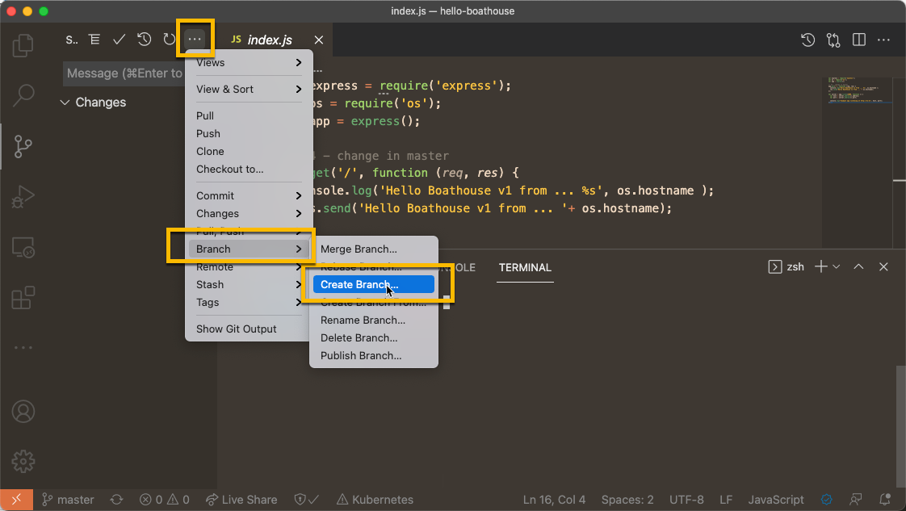

使用以下命令或者Git History插件获取当前的历史记录，效果如下：

注意：当前的HEAD上显示了叫做feature1的指针


## 02 - 在 feature1 上创建 C5，C6 提交

按以下截图在 index.js 中添加第6行代码，并添加提交说明：C5 - change in feature1

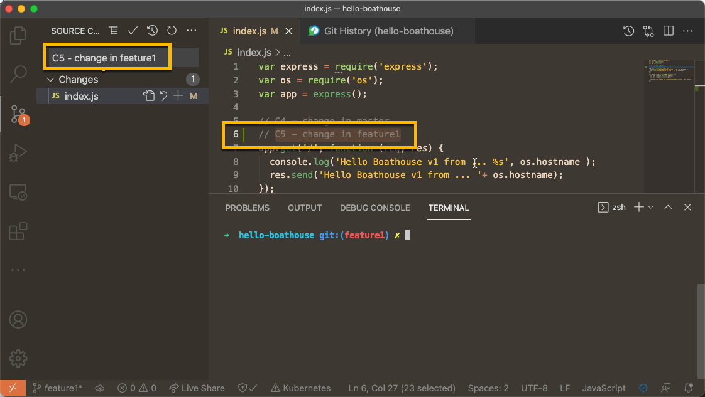

按以下截图在 index.js 中修改第8行代码，升级到v2，并添加提交说明：C6 - upgrade to v2 in feature1


查看历史记录，注意其中master和feature1的分支指针位置

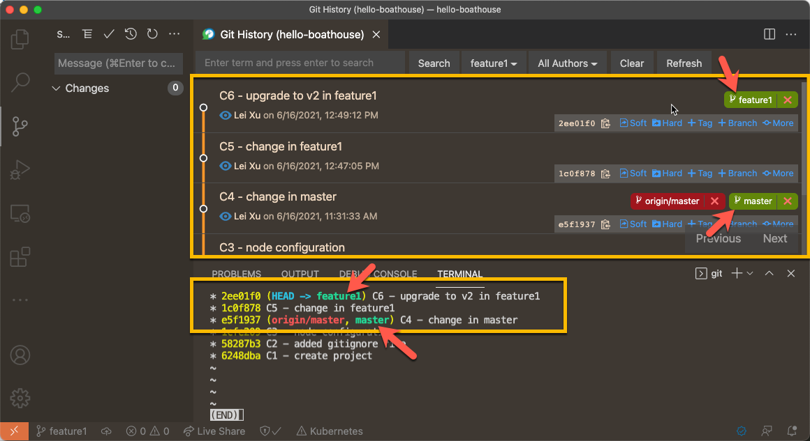

我们当前的git数据结构如下：

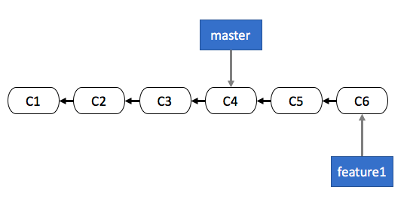

## 03 - 创建hotfix分支

使用以下命令创建并切换至hotfix分支，注意hotfix分支需要基于master的版本创建

```shell
## 切换回到master分支，确保我们基于master的版本创建hotfix分支
git checkout master
## 创建并切换到hotfix分支
git checkout -b hotfix
```

注意：切换回到master分支后，我们本地的index.js状态随即发生改变，之前在feature1上所做的修改已经消失。


你也可以使用vscode创建hotfix分支，注意一定要选择 Create Branch From 这个选项

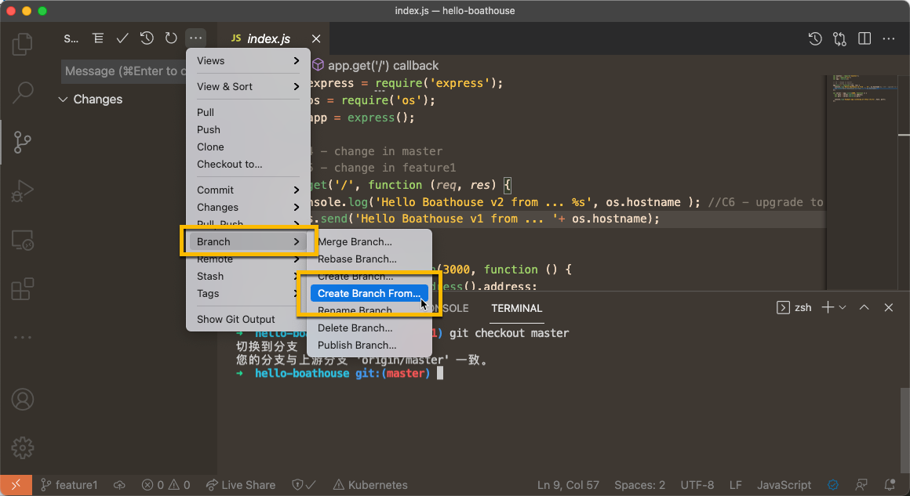

## 04 - 在hotfix分支上创建C7，C8提交

按以下截图在index.js的第8行修改版本号到v2，并加入提交说明：C7 - v2 in hotfix

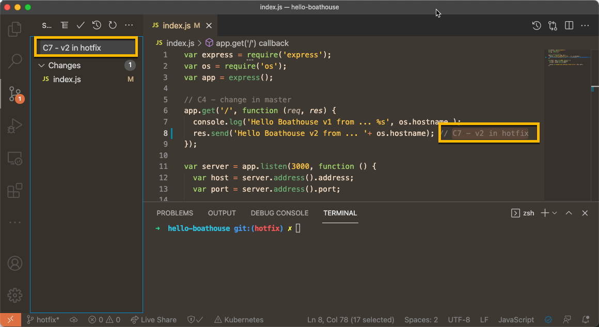

按以下截图在index.js的第7行修改版本号到v2，并加入提交说明：C8 - v2 in hotfix

注意：这个改动和我们在feature1分支上进行的C6同时修改了一行代码，这将在后续的操作中造成冲突。

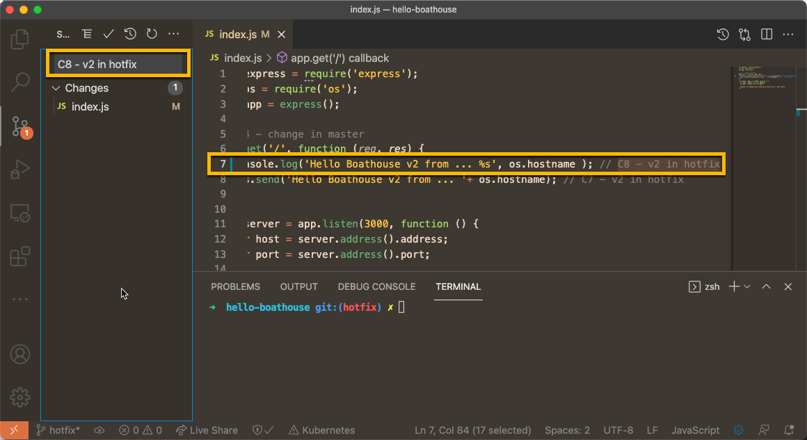

git历史记录状态

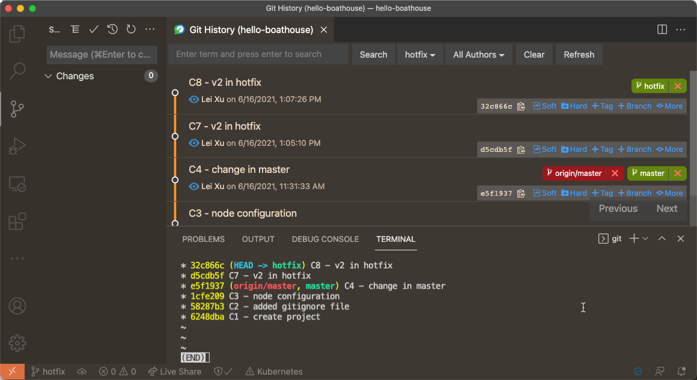

我们当前的git数据结构如下：


## 05 - 将hotfix合并到master分支

使用以下命令切换回到master分支，并将hotfix分支上的提交合并进来

```shell
git checkout master
git merge hotfix
```

注意：因为我们的hotfix完全基于master分支，因此git采用了Fast-forward的方式

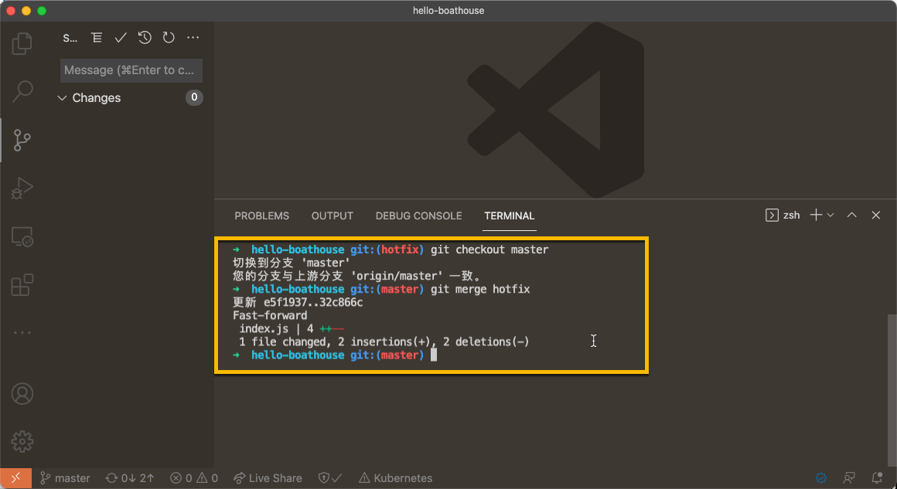

查看历史记录

注意：此时git实际上只是移动了原来的master分支指针而已


## 06 - 回到feature1分支并提交C9提交，并合并到master分支，处理冲突

按以下截图在index.js的第16行添加代码，并加入提交说明：C8 - change in featrue1

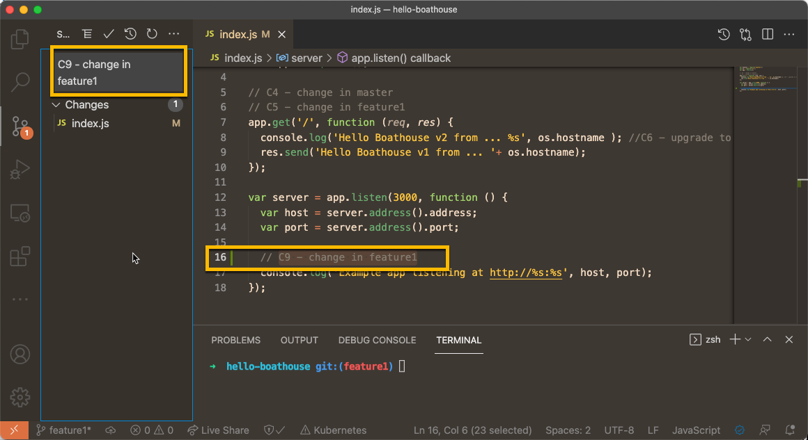

使用以下命令切换到master分支并合并feature1进来

```shell
git checkout master
git merge feature1
```

执行以上操作后，git会检测到冲突并进入三方合并状态

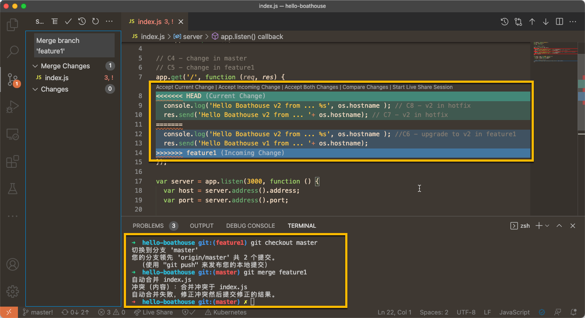

此时，我们需要修改index.js，手工完成冲突代码的合并，合并之后的状态如下

注意：因为是解决了冲突代码，我们需要手动完成代码的stage。


完成提交后，再次查看历史记录

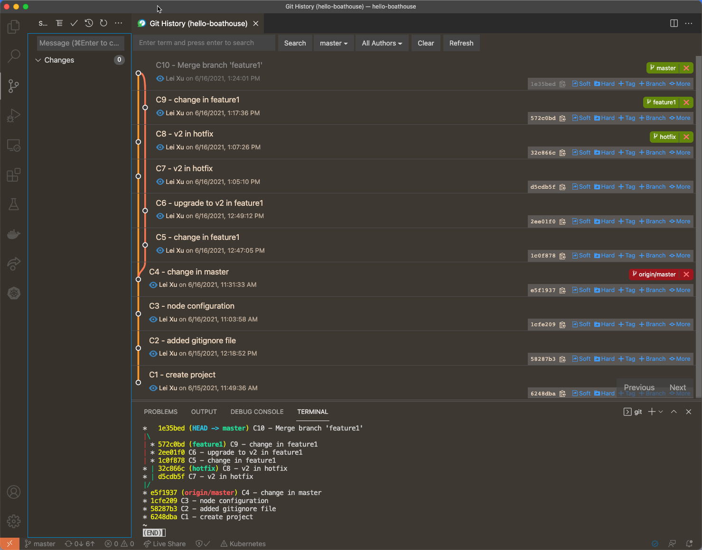

我们最终的git数据结构如下：

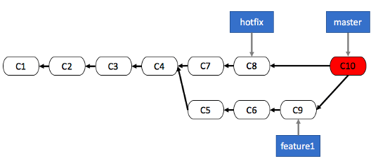

## 07 - 推送代码到Gitea服务器

使用以下命令完成代码推送

```shell
git push
```

完成推送后，再次查看历史记录

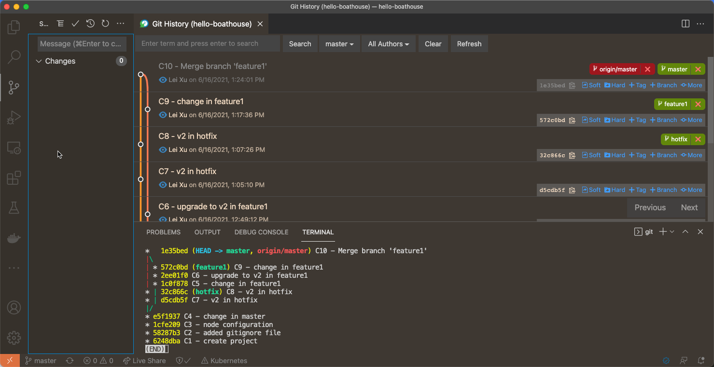

注意：以上操作也仅仅是改动了origin/master这个指针的位置而已。

我们也可以通过Gitea上的【提交图】查看同样的历史记录。

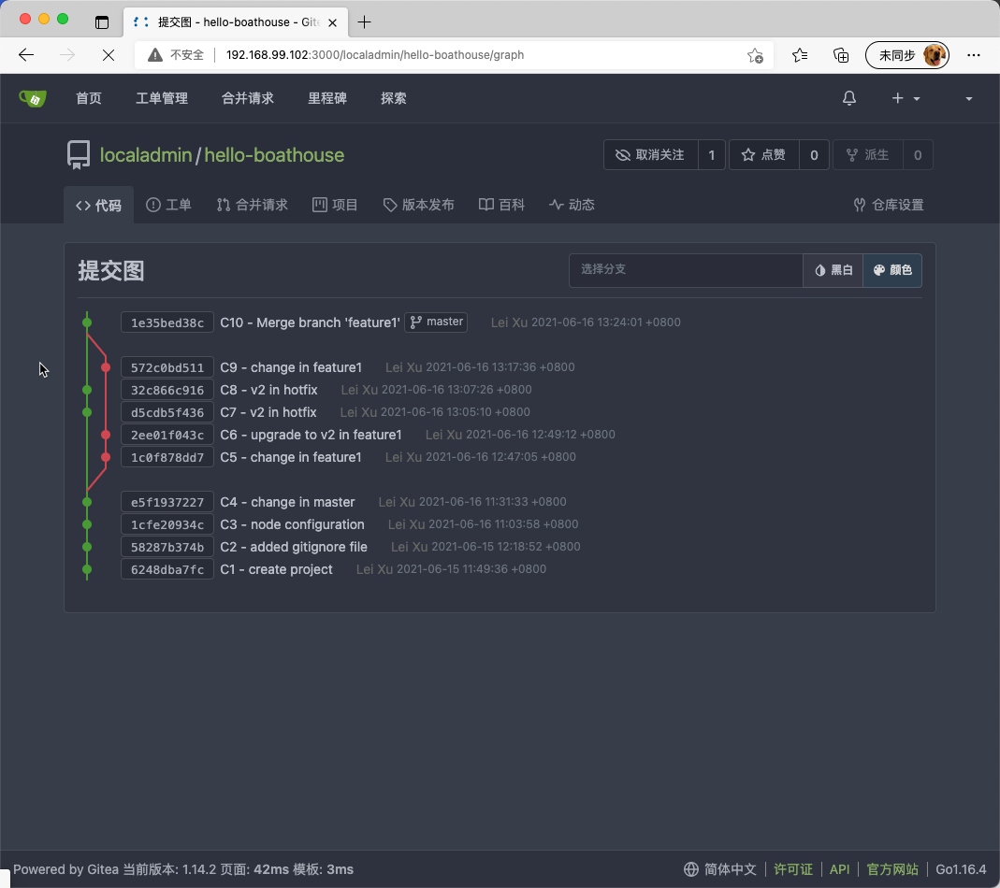

## 小结

在本节实验中，我们完成了一个典型的git本地工作流过程，大家可以通过这个实验对于git的版本历史记录工作方式有更加深入的理解。

